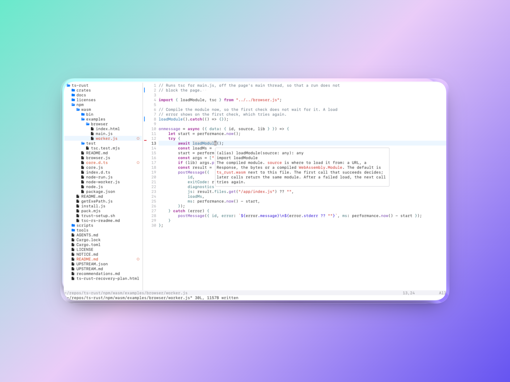

# wok

Neovim without the config.

Most Neovim distros give you a config to make your own. wok takes the opposite approach: the configuration is part of the product.

Install it, open a project, and use it. Plugins, language servers, defaults, and upgrades are maintained together and shipped as releases.

```sh
brew install drewradcliff/tap/wok
wok .
```



## What's different

- **Upgrades like an app.** `brew upgrade wok` when there's a new release.
- **Neovim-first.** Uses Neovim 0.12's plugin manager, completion, and LSP support, with a deliberately small plugin set.
- **Languages work automatically.** Open a supported project and wok installs the appropriate language server without requiring Mason.
- **Made for macOS.** System clipboard, Trash, default-app opening, mouse support, and native-feeling behavior are configured out of the box. 
- **Code review built in.** Review working-tree changes without leaving the editor.

| Key | Action |
| --- | --- |
| `Space Space` / `Cmd-P` | Find files |
| `Space /` | Search in project |
| `Space e` | Toggle file explorer |
| `Space g d` | Review changes |
| `gd` | Definition |
| `K` | Documentation |
| `Space s d` | Diagnostics |

See [all keys](docs/keys.md)

## Languages

The first time you open a file in a language, its server and syntax highlighting download in the background.

| Language | Support |
| --- | --- |
| TypeScript / JavaScript | Built in |
| Python | Built in |
| Rust | Built in; requires Rust |
| Go | Built in; requires Go |
| Swift, C, C++ | Uses Xcode tools |

## Your settings

```lua
-- `~/.config/wok.lua`

vim.opt.relativenumber = true
vim.keymap.set("n", "<leader>q", "<Cmd>quit<CR>", { desc = "Quit" })
```
> wok works without any configuration. If you want to change a few things, such as an option or a keymap, put them here. It runs after wok's own config, and upgrades never touch it.

## Who it's for

- You use VS Code, Cursor, or Zed and want something smaller.
- You know Vim's keys, or want to learn them, and want an editor that's ready on day one rather than a project.
- You've maintained a Neovim config before and would rather not again.

It's probably not for you if:

- You want to build your setup piece by piece.
- You want a large plugin collection or an integrated debugger.

## Uninstall

```sh
brew uninstall wok
```

